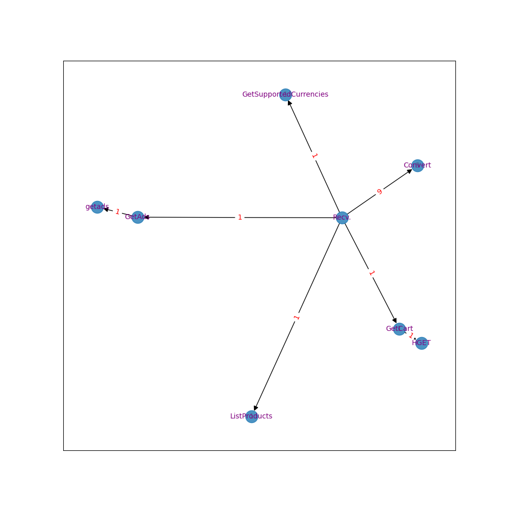
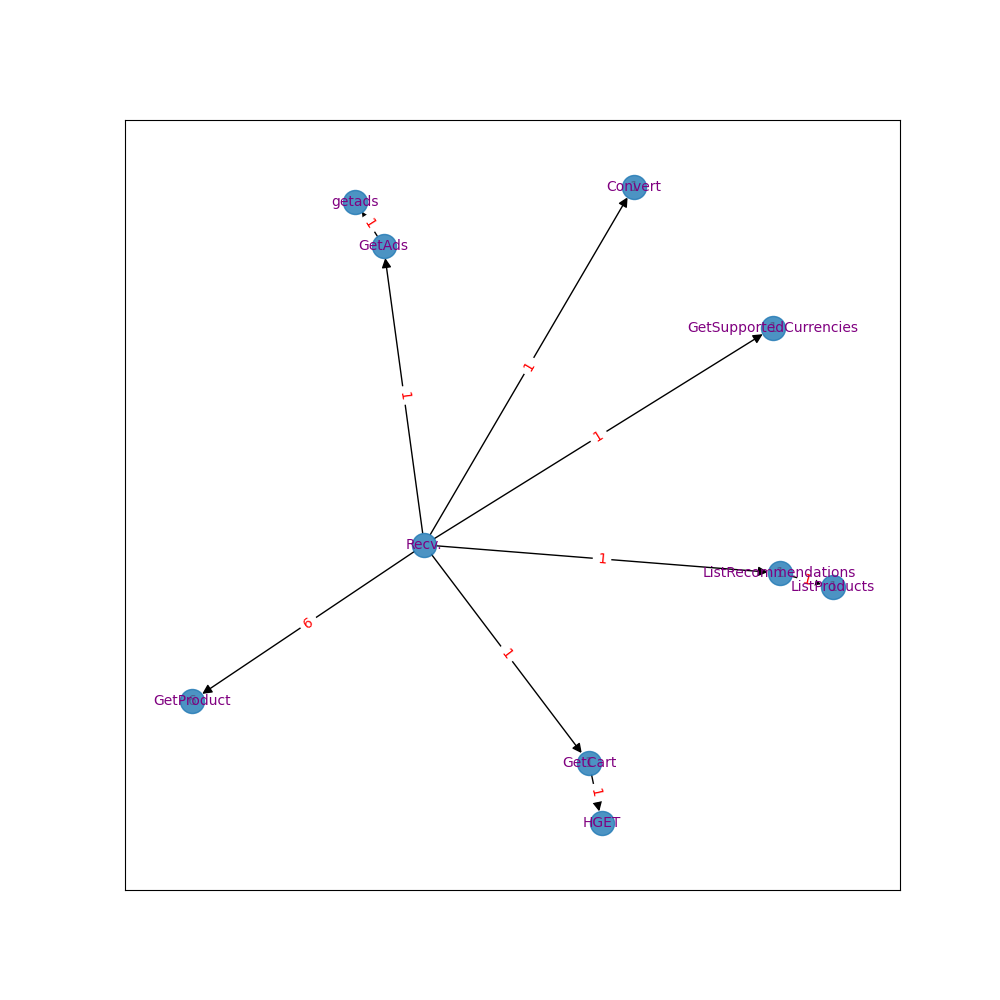
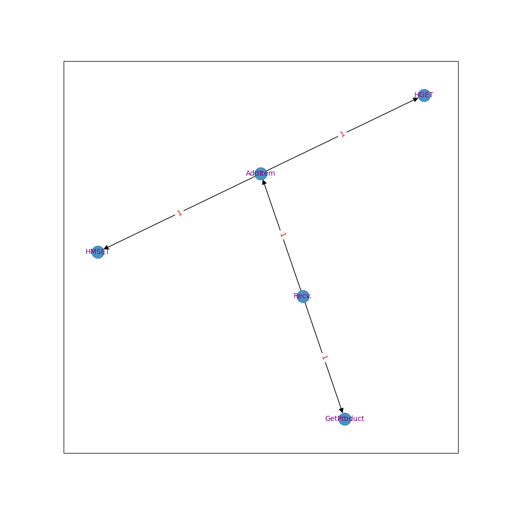
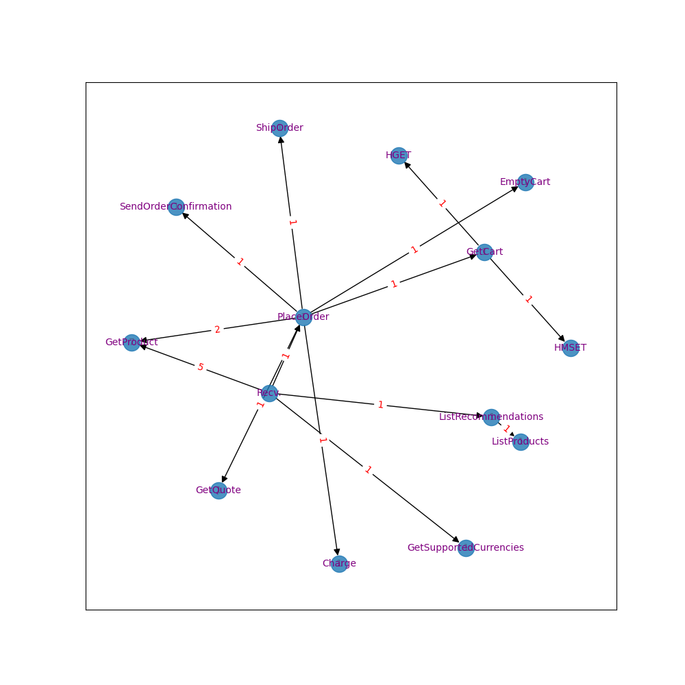

[TOC]


## 一、概览

### 1. 五种顶层span的operationName

```json
# {'GET', 'HGET', 'SET', 'hipstershop.CurrencyService/Convert', 'hipstershop.Frontend/Recv.'}
# {'hipstershop.Frontend/Recv.': '0bbd1787569e6baf68bd9d9f87109e86',
#  'hipstershop.CurrencyService/Convert': 'b6e69f8f834d7aa1647bdd3d60072368',
#  'HGET': 'e852d921c5db0845822790c90c116cf5', 'SET': '9f3bbfe4a9ae9147b22f2ccb666372d7',
#  'GET': '82aa83ee59e5aa499cef79496e3b63c8'}
```

### 2. 所有operatoinName

```json
{
    "operation_name": [
        "hipstershop.Frontend/Recv.",
        "hipstershop.ProductCatalogService/GetProduct",
        "hipstershop.CurrencyService/GetSupportedCurrencies",
        "grpc.hipstershop.CurrencyService/GetSupportedCurrencies",
        "hipstershop.CartService/GetCart",
        "/hipstershop.CartService/GetCart",
        "HGET",
        "hipstershop.CurrencyService/Convert",
        "grpc.hipstershop.CurrencyService/Convert",
        "hipstershop.RecommendationService/ListRecommendations",
        "/hipstershop.RecommendationService/ListRecommendations",
        "/hipstershop.ProductCatalogService/ListProducts",
        "hipstershop.ProductCatalogService/ListProducts",
        "hipstershop.AdService/GetAds",
        "hipstershop.adservice/getads",
        "hipstershop.ShippingService/GetQuote",
        "hipstershop.CartService/AddItem",
        "/hipstershop.CartService/AddItem",
        "HMSET",
        "hipstershop.CheckoutService/PlaceOrder",
        "hipstershop.PaymentService/Charge",
        "grpc.hipstershop.PaymentService/Charge",
        "hipstershop.ShippingService/ShipOrder",
        "hipstershop.CartService/EmptyCart",
        "/hipstershop.CartService/EmptyCart",
        "hipstershop.EmailService/SendOrderConfirmation",
        "/hipstershop.EmailService/SendOrderConfirmation",
        "SET",
        "GET"
    ]
}
```


## 二、'Convert'以及'Recv.'示例

### 1. homeHandler("/", get)

#### traceID

0bbd1787569e6baf68bd9d9f87109e86

#### 程序输出

> Convert--->Convert : 9
> GetSupportedCurrencies--->GetSupportedCurrencies : 1
> ListProducts--->ListProducts : 1
> GetCart--->GetCart : 1
>
> ******
> create_success: True
> total span num (28) = parent (1) + cycles (12) + draw (15)
> parent: hipstershop.Frontend/Recv.



### 2. productHandler("/product/{id}", get)

#### traceID

6e4a73ad16481ae5eeed67e17c67b69e

#### 程序输出

> GetSupportedCurrencies--->GetSupportedCurrencies : 1
> GetProduct--->GetProduct : 6
> ListProducts--->ListProducts : 1
> ListRecommendations--->ListRecommendations : 1
> Convert--->Convert : 1
> GetCart--->GetCart : 1
>
> ******
> create_success: True
> total span num (26) = parent (1) + cycles (11) + draw (14)
> parent: hipstershop.Frontend/Recv.



### 3. addToCartHandler("/cart", post)

#### traceID

207c189641b349f75c246b0f6619a897

#### 程序输出

> AddItem--->AddItem : 1
> GetProduct--->GetProduct : 1
> ******
> create_success: True
> total span num (7) = parent (1) + cycles (2) + draw (4)
> parent: hipstershop.Frontend/Recv.



### 4. emptyCartHandler("/cart/empty", post) to verify

没有找到

### 5. viewCartHandler("/cart", get)

没有找到 

### 6. placeOrderHandler("/cart/checkout", post)

####  traceID

8ead3831c21ed055a29295ea6776d62c

#### 程序输出

> GetQuote--->GetQuote : 1
> Charge--->Charge : 1
> GetSupportedCurrencies--->GetSupportedCurrencies : 1
> GetProduct--->GetProduct : 7
> GetCart--->GetCart : 1
> ListRecommendations--->ListRecommendations : 1
> ShipOrder--->ShipOrder : 1
> PlaceOrder--->PlaceOrder : 1
> SendOrderConfirmation--->SendOrderConfirmation : 1
> ListProducts--->ListProducts : 1
> EmptyCart--->EmptyCart : 1
>
> ******
>
> create_success: True
> total span num (37) = parent (1) + cycles (17) + draw (19)
> parent: hipstershop.Frontend/Recv.



### 7. logoutHandler("/logout", get)

没有找到


### 8. setCurrencyHandler

#### traceID

b6e69f8f834d7aa1647bdd3d60072368

#### 程序输出

> Convert--->Convert : 1
> ******
> create_success: True
> total span num (2) = parent (1) + cycles (1) + draw (0)
> parent: hipstershop.CurrencyService/Convert


## 三、HGET、SET、GET示例

### 1. HGET

#### traceID

e852d921c5db0845822790c90c116cf5

#### 程序输出

>create_success: True
>total span num (1) = parent (1) + cycles (0) + draw (0)
>parent: HGET

### 2. SET

#### traceID

9f3bbfe4a9ae9147b22f2ccb666372d7

#### 程序输出

>create_success: True
>total span num (1) = parent (1) + cycles (0) + draw (0)
>parent: SET

### 3. GET

#### traceID

82aa83ee59e5aa499cef79496e3b63c8

#### 程序输出

>create_success: True
>total span num (1) = parent (1) + cycles (0) + draw (0)
>parent: GET

